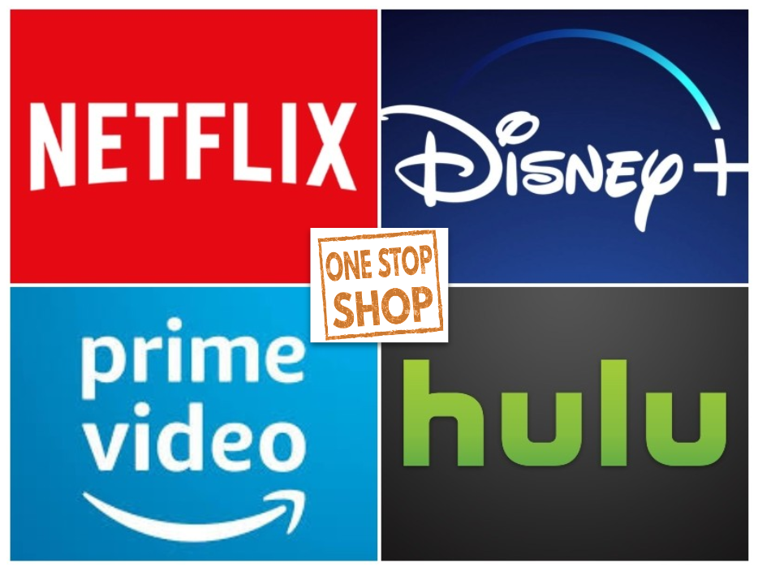
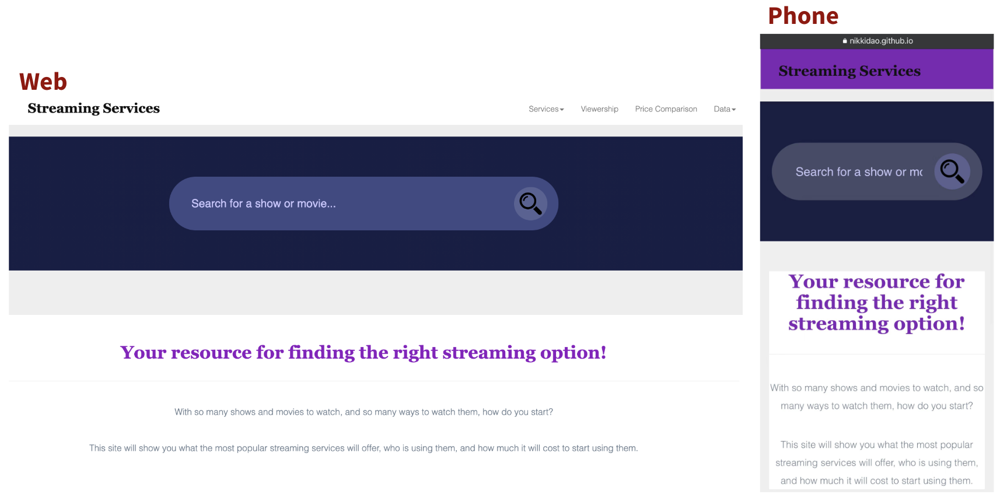
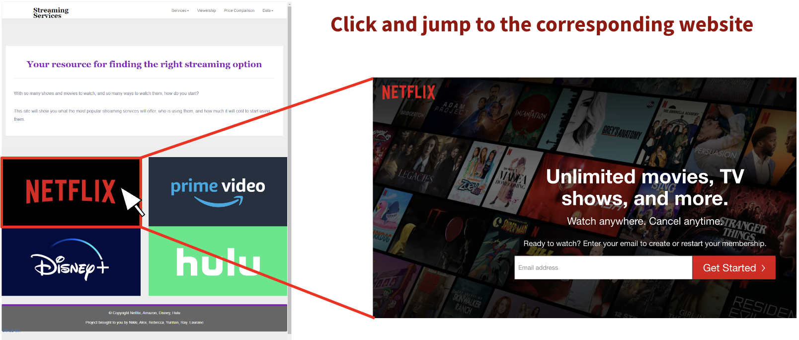
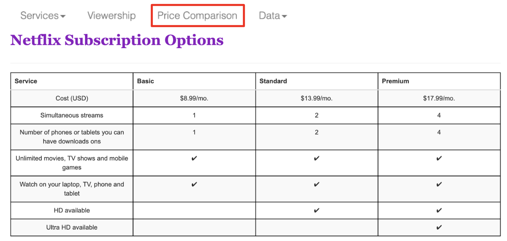
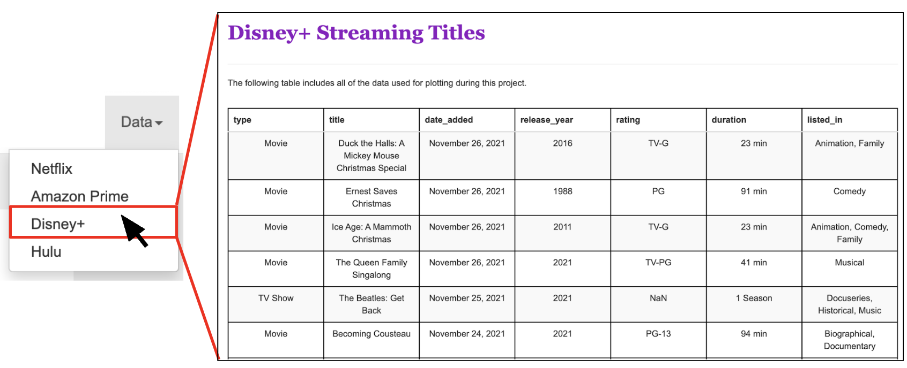
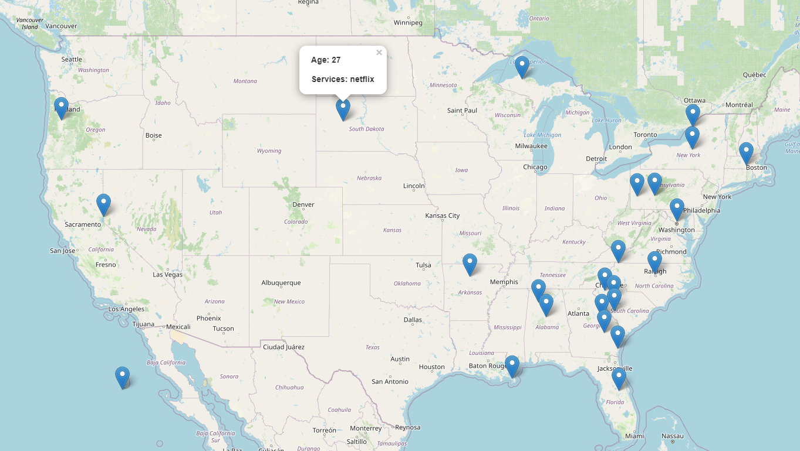

# Project 3: Streaming Service

## Team Members:
* Nikki Dao
* Laurane Gerber
* Alex Riska
* Rebecca Watson
* Yuntian Xue
* Ray Yoon

## Project Goal: 
Video streaming is now the dominant channel for online entertainment sources to enter  viewers’ virtual doorsteps. Our goal is to provide a one-stop shop to enhance overall user experience within four most popular streaming platforms: Netflix, Amazon Prime, Disney+, and Hulu.

We provide an easy search option across 4 platforms for current subscribers to find their desired content at their fingertips, without the restriction of specific devices . Additionally, for potential subscribers who're still deciding which streaming service is best for them, they can find their answers by viewing our detailed comparisons without feeling overwhelmed. 

   

## Resources:

Data Source:
* [Netflix Movies and TV Shows](https://www.kaggle.com/datasets/shivamb/netflix-shows)
* [Amazon Prime Movies and TV Shows](https://www.kaggle.com/datasets/shivamb/amazon-prime-movies-and-tv-shows)
* [Disney Movies and TV Shows](https://www.kaggle.com/datasets/shivamb/disney-movies-and-tv-shows)
* [Hulu Movies and TV Shows](https://www.kaggle.com/datasets/shivamb/hulu-movies-and-tv-shows)

Tools: 
- Python, Pandas, SQLAlchemy, Jupyter Notebook, PostgreSQL, pgAdmin 4, JavaScript, Leaflet 

 

## Results:

### Data Extract, Transform and Loading
* Extract: We did data extraction from CSV files. We cleaned the data using pandas.
* Transform: We transformed data into dataframes. We transformed dataframe into html tables for web visualization. 
* Load: We load our dataframe to sqlite database, which was used for our movie search function. 

### Website Visualization
* Dashboard page: We have edited the Bootstrap to fit both computer and phone browsers. 

   

* Services pages: Each picture linked to the corresponding service website in a new tab. The "Services" dropdown menu in the navigation bar has the same function. 

   

* Price Comparison page: This listed four tables that compared the subscription plans in the four platforms for potential subscribers to choose.

   

* Data pages: These pages aimed to show the raw data of our website. We used these data in our sqlite database that used for the search of each movie's detailed.

   

### Website Deployment
* The link to our website:
[Streaming Services](https://nikkidao.github.io/Project_3/)

* We also created a QR code for mobile devices:

   

### The Functions Being Developed
The following functions are still in development and have not been released in our current webpage version. 
* The first one is the movie search function. We want to connect the website with the sqlite database we created. Ideally, customers can search for the movie's information using the search bar in our dashboard page. 

* The second function is the "Viewership" tab in our navigation bar. We applied Leaflet to visualize the geographical information of the subscribers in different streaming platforms. With the current data source we have, we were able to create the map that showed location, service and the age of subscribers (see pic below). However, the current data source has limitations such as missing values. With more valid data we are going to develop a viewership map that contains different layers (based on different services) with more detailed subscriber information. 

   

 

